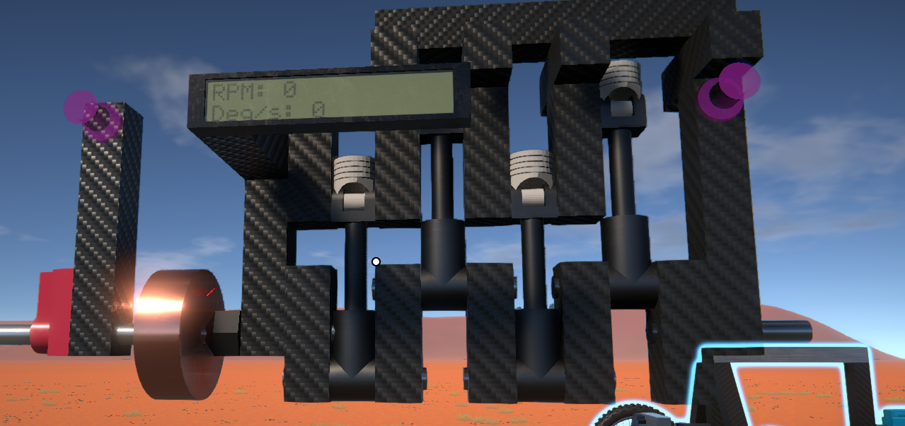
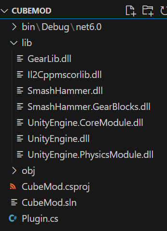
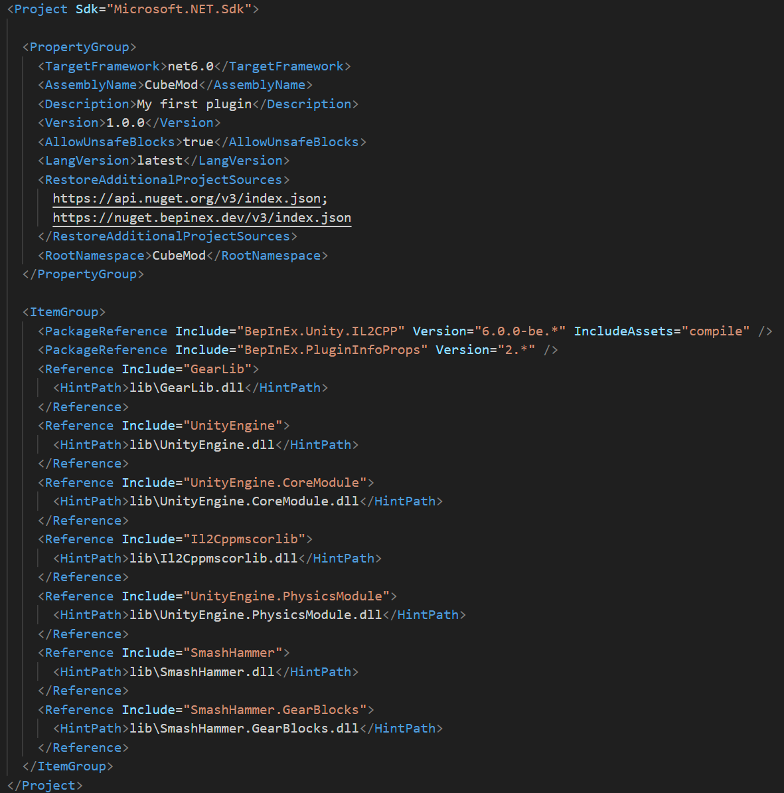
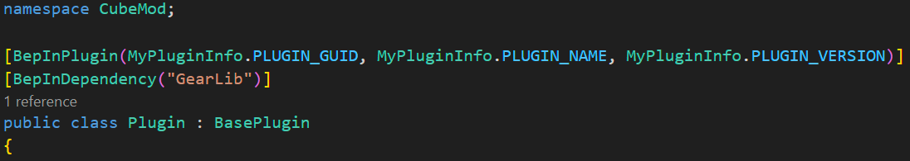
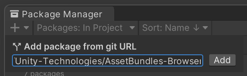
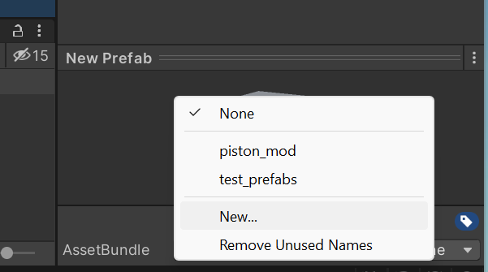
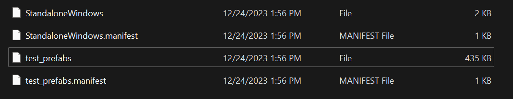

# GearLib - Library for GearBlocks Mods
This library is aimed at making GearBlocks modding easier. People familiar with BepInEx can utilize this plugin to create custom parts with custom models and scripting!

GearLib does **NOTHING** by itself. This mod is simply a tool for modders to create mods for the game. However, it is a requirement for any mods made using it. Modders please let people know this is a requirement and write the requirement into your mod before distribution.

## Spotlighted Mods using GearLib!
### Combustion Motors
Adds in combustion motor parts for building your own engines!\
https://github.com/KaBooMa/CombustionMotors\

## Installation (Player)
- Install BepInEx 6 into your GearBlocks folder **(Currently confirmed working version is BE release #679, IL2CPP-win-x86. You can download that here: https://builds.bepinex.dev/projects/bepinex_be)**
- Install GearLib into your new BepInEx/plugins folder.
- You're done! Go find some mods that utilize the library <3

## Why not use Thunderstore?
I am currently in talks with the Thunderstore team. We're hoping to have GearBlocks mods available on the Thunderstore in the near future! This will make it as easy as clicking the mods you want to download in the future.

## Feature For Modding
While these features are possible in BepInEx alone without GearLib, they'd require manual manipulation of the game assets without help from GearLib. Below are the features ready to go with this release.

- [x] Import custom models into the game
- [x] Add attachments to parts for mounting to other parts
- [x] Add link nodes for linking parts together logically
- [x] Add custom behaviour scripts for parts to provide part logic
- [x] Parts can have their own configurable options within their scripts

## Installation (Modder)
**Please let me know of any issues during this process, as there has been minimal testing here thus far**

The setup to begin modding is a bit more involved, so buckle up. It might be beneficial to have a video created, but for now, here is written documentation on how to do so. 

There are three parts to getting this setup. You'll need Unity to create Asset Bundles for your custom part models. Next you will need BepInEx 6 and it's templates for creating your plugin. Lets start with BepInEx 6. You'll also need to follow the player guide, as you'll be testing your mods.

### First Part: Player Setup
Follow the player installation guide above to get your game setup and ready for mods. Then come back for the second part.

### Second Part: BepInEx Setup
Ensure you have an IDE installed. I will be using VSCode during this guide, however, VSCommuntiy is perfectly viable as well. It might even make some steps easier :)
- Install the .NET SDK 6.0 from here: https://dotnet.microsoft.com/en-us/download/dotnet/6.0
- Grab the BepInEx templates by opening your terminal and using command `dotnet new -i BepInEx.Templates::2.0.0-be.1 --nuget-source https://nuget.bepinex.dev/v3/index.json`
- Create your new plugin directory using the template. You can do this by opening a terminal in the directory you want it stored in and using command `dotnet new bep6plugin_unity_il2cpp -n MyFirstPlugin -T net35`
- You now have a plugin directory! However, there's a couple dependencies you'll want to ensure you can mod for GearBlocks. I recommend creating a directory in your plugin directory called "libs". The name doesn't matter, since you'll be referencing it anyways and can modify to fit your wants. **Game dependencies are found under `BepInEx/interop`. Ensure you grab them from here!!**
  - I recommend starting with at least "SmashHammer.dll, SmashHammer.GearBlocks.dll, UnityEngine.dll, UnityEngine.CoreModule.dll, and GearLib.dll". You can pull in additional references as needed. For example, if you wish to alter Rigidbodies in your plugin, you'll need UnityEngine.PhysicsModule.dll. \

- Now that you have your references in their directory, you need to reference them. Open your MyFirstPlugin.csproj file, and add the references to your specific files, as seen below.\

- One last piece for your BepInEx plugin, add a dependency for "GearLib" to it! This is done by adding `[BepInDependency("GearLib")]` above your plugin class.\

### Third Part: Unity Setup

You'll need to install Unity version 2021.3.33f1 specifically to create your Asset Bundles.
- Download Unity here: https://unity.com/releases/editor/whats-new/2021.3.33
- You'll also need Unity Hub for it to work. You can grab that off the main Unity page here: https://unity.com/unity-hub
- Create a new Unity Project 3D. No settings need changed, you can name it whatever.
- You'll want to install a Unity package called "Asset Bundle Browser". This lets us export our Asset Bundles from the project. In Unity, click "Window > Package Manager", then click the "+" in the top-left and "Add package from git URL...". Paste in "https://github.com/Unity-Technologies/AssetBundles-Browser" and click "Add"\

- Lets create a test prefab. At the bottom project section, click the "Assets" folder and right click the background. "Create > Prefab", name it whatever you wish, but remember the name as you'll reference it in your plugin code later.
- Double click your new prefab and for testing purposes, right click your prefab object on the left panel, "3D Object > Cube". You now have a cube!
- At this time, GearLib does not handle BoxColliders, so on the right panel for your new cube, delete the BoxCollider component.
- Add a new "Empty" game object to your prefab and call it "Collider". It doesn't really matter on naming, but Collider is what the GearBlocks developer names these.
- Add a component "MeshCollider" to your Collider game object. Under the "Mesh" property, click and assign the cube model as the mesh.
- To export your new prefab for loading into the game, click your prefab at the bottom panel and at the bottom right, assign a new bundle name to it.
\
- Now under "Window > Asset Bundle Browser", you can click the "Build" tab and "Build" button. It will store it in your Unity project folder under Assetbundles/Standalone by default. You only need the one named your bundle, such as the picture below.\

- Your new bundle is ready to be added to your plugin folder. You need to include this same asset along with your distribution for players, or embed it into your plugin DLL.

## Modding Guidance
Reach out in the official Discord to KaBooMa for guidance at this time. See the spotlighted mods for examples!

### Quick Guidance
- Unity Explorer can really help you see what is going on in the game. The working version of UE is located here: https://github.com/sinai-dev/UnityExplorer/releases/latest/download/UnityExplorer.BepInEx.IL2CPP.CoreCLR.zip
- GearLib.Parts contains a Part class that can be used to create new parts within the game. `Part my_custom_part  = new Part("MyPluginFolder/assets/my_custom_prefab", "PrefabNameInUnity", 1234, "My Custom Parts Name", "Props");`
  - Take note, 1234 is a unique id for your part. Use something random for now till a better solution is found for the library. Overlapping ids with other parts will cause the game to crash.
  - Props is one of the categories in the parts tab menu. You can use any that you like, such as Blocks, or Power.
- You can add attachments to a part by using `my_custom_part.AddAttachmentPoint(AttachmentTypeFlags.TYPE_HERE, AlignmentFlags.TYPE_HERE, new Vector3(0f, 0f, 0f));`
- Custom behaviours can be added. These are scripts that let you trigger changes upon creation of your part and on update of your part. To create a new behaviour, make a class and inherit BehaviourBase from GearLib. Add your Start / Update methods to your new class. To add the behaviour to your part, use the following code: `my_custom_part.AddBehaviour<MyCustomBehaviour>();`
  - Behaviours have access directly to the following properties pulled from GearBlocks:
    - descriptor : Contains information about the part, name, mass, linked nodes, etc.
    - composite : This seems to be a grouping of all parts that are connected and move together as one rigidbody.
    - rigidBody : This provides access to the rigidbody of the part. This is not specific to the part, as the composite makes up the rigidbody.
    - construction : Groups all parts associated with a construction together. You can enumerate the parts if needed using this.

## How to contribute
If you encounter any bugs or have suggestions on things to add support for within this library, please open a new issue here on GitHub, or reach out to KaBooMa on the official GearBlocks Discord server!

Anyone that would like to make changes/additions to the library, feel free to create a pull request. I will review and apply those changes :)